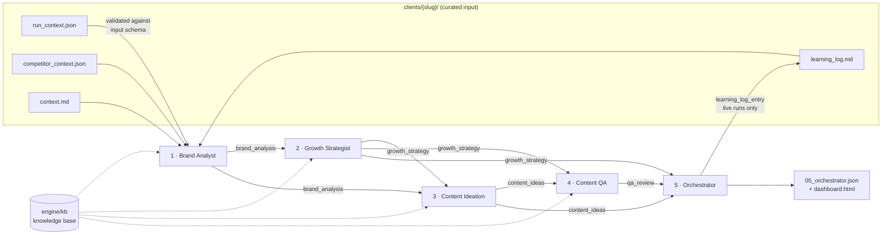
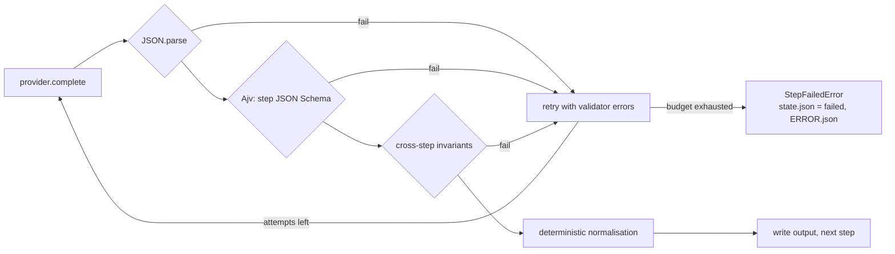

# content-engine-multiagent

A five-step LLM pipeline that turns a hand-curated brand brief into a content strategy:
brand analysis → growth strategy → content ideas → scored QA review → a 7-day calendar.
Each step is a separate model call with its own prompt and **its own JSON Schema contract**, and
the engine, not the model, decides what counts as a valid hand-off between steps.

The repository ships a **fictional client** (Quillfern Plant Co., a made-up houseplant brand) and an
**offline provider**, so everything below runs without an API key, a network connection or cost.

## The problem

Chaining LLM calls is easy. Making a chain whose output you can trust is not:

- a step returns prose around its JSON, or JSON with the wrong shape, and the next step builds on it;
- a later step invents things the earlier steps never produced (a pillar nobody defined, an idea id that does not exist);
- the model does arithmetic it was told to do (averages, verdicts, counts) and gets it wrong;
- a failure halfway through leaves you with half an output and no record of why.

This engine treats every model response as untrusted input and puts a validator between each step.

## Architecture



Every arrow between agents passes through the same gate:



### Contracts between steps

| Step | Receives | Returns (schema in `engine/schemas/`) | Checked by code beyond the schema |
|---|---|---|---|
| 1 Brand Analyst | `run_context`, `competitor_context`, `context_notes`, `learning_log` | positioning, strengths, typed `gaps`, `viral_patterns_observed` (funnel stage, intent…), `opportunity_angles`, `confidence_notes` | — |
| 2 Growth Strategist | `run_context`, `brand_analysis` | `content_pillars` (purpose ∈ reach/nurture/convert), `content_mix`, notes | both mixes add up to 100; unique, non-empty pillars |
| 3 Content Ideation | `run_context`, `growth_strategy`, `brand_analysis`, `min_ideas` | `ideas[]` with id, pillar, format enum, hook, script outline, intent, pattern source | at least 8 ideas; unique ids; every idea uses an existing pillar; every pillar has an idea |
| 4 Content QA | `content_ideas`, `growth_strategy`, `run_context` | `reviewed[]` with seven integer scores, reason, suggestion; `summary` | reviews exactly the generated ids; scores are integers 0–5; `claim_safety` ≤ 1 always rejects |
| 5 Orchestrator | `run_context`, `growth_strategy`, `content_ideas`, `qa_review` | `calendar_7_days`, `metrics_to_track`, `learning_log_entry` | not called if QA rejected everything; exactly 7 days; only known ids; never a rejected idea; `revise` ideas only when fewer than 7 are approved; repeats only when fewer than 7 ideas are schedulable |

Every rule in the last column has a test that breaks it on purpose (`tests/invariants.test.js`,
`tests/pipeline.test.js`).

The client input (`run_context.json`) is validated too, before the first model call, so a broken brief
fails fast and costs nothing.

## Design decisions

**JSON Schema between agents.** The schema is the interface. It is sent to the provider as a strict
structured-output constraint *and* included in the system prompt (for providers that ignore
`response_format`), and the response is still validated locally with Ajv in strict mode. Provider-side
structured output reduces bad responses; local validation is what guarantees them. Strict parsing is
deliberate: no fence stripping, no JSON repair. A response wrapped in Markdown is a rejected attempt.

**Containing hallucinations.** A schema cannot say "this pillar must be one the previous step defined".
`src/invariants.js` does: it cross-checks ids, pillar names, mix totals and calendar choices against the
earlier validated outputs. A violation is fed back to the model as a list of concrete errors
(`idea "idea_03" uses unknown pillar "…"`), and the step gets one retry by default (`maxAttempts: 2`).
If the retry fails, the run stops. Nothing is fabricated for the failed step, and `ERROR.json` records
every rejected attempt.

**The model scores; the engine decides.** QA returns seven integer scores per idea. The average, the
verdict (≥ 4 approved, ≥ 2.5 revise, otherwise rejected) and the summary counts are recomputed by code
(`src/normalize.js`). One rule sits above the average: a `claim_safety` score of 0 or 1 (a guaranteed
result, an income figure) rejects the idea whatever its other scores are, so a strong hook cannot carry
an unsafe claim into the calendar. Calendar entries copy `format`, `pillar`, `intended_action` and
`status` from the referenced idea and its verdict, and the learning-log `run_id` comes from the CLI.
Each of these overrides is logged in `state.json` as an `adjustment` when it changes what the model
returned, so you can see how often the model got it wrong. The honesty notes in the final output are
constants in code, never generated.

**A contract the model can actually satisfy.** The calendar needs seven ideas that QA did not reject.
Ideation therefore has to return at least eight ideas. If QA still leaves fewer than seven, the
orchestrator may repeat ideas (and only then). If QA rejects everything, the run stops with
`StepBlockedError` *before* the orchestrator call, instead of paying for a call that cannot succeed.

**Provider errors are not retried.** HTTP errors, refusals and `finish_reason: length` (truncation) raise
`ProviderError` right away. Retrying a truncated response with the same `max_tokens` would just waste
money. The error message points to the per-step `max_tokens` setting instead.

**Offline and live runs never mix.** Offline runs are written to `<run_id>__mock/` and never touch the
client's learning log. Only live runs append to it, and the next run feeds it to the Brand Analyst.

**Cost.** One model call per step: five calls for a clean run, at most `5 × maxAttempts` in the worst case.
The knowledge base goes only to the four steps that use it. Prompt and completion tokens are summed in
`state.json` (`usage_total`). The engine does not convert tokens to money, because prices depend on the
model you configure. Models and `max_tokens` are set per step in `engine/config/models.json`, and
`CONTENT_ENGINE_MODEL` overrides all of them. For example, you can run a cheaper model first and switch
only the Brand Analyst to a stronger one.

**Small surface.** One runtime dependency (Ajv). The live provider talks to OpenRouter's
OpenAI-compatible Chat Completions endpoint with plain `fetch`; `OPENROUTER_BASE_URL` points it at
another compatible endpoint. The API key is redacted from provider error text before it can reach an
error message, `state.json` or `ERROR.json`. The code is plain ES modules type-checked with
`tsc --checkJs --strict`. Step definitions are typed per contract (`src/steps.js`): the only cast from
validated JSON to a contract type is in one function, right after Ajv has checked the schema.

## Repository layout

```
bin/                 CLIs: run-pipeline, new-client, build-dashboard
src/                 pipeline runner, step definitions, validation, invariants, normalisation, providers
engine/agents/       one system prompt per step (Markdown)
engine/schemas/      output contract per step + input schema for run_context.json
engine/kb/           generic knowledge base (hooks, content patterns, diagnostic protocols, a fictional exemplar)
engine/fixtures/     synthetic responses used by the offline provider and the tests
engine/config/       per-step model configuration
engine/dashboard/    self-contained HTML run viewer template
clients/_template/   scaffold copied by new-client
clients/quillfern/   the fictional sample client
examples/            a committed offline run (synthetic) with its dashboard
tests/               node:test suite; tests/support/ holds the scripted test provider
```

## How to run it

Requires Node.js 22 or newer.

```bash
npm ci

# Offline demo: synthetic fixtures, no key, no network, no cost
npm run demo                 # writes .demo-runs/demo__mock/ and dashboard.html

# Quality gates (the same ones CI runs)
npm run lint                 # Biome
npm run typecheck            # tsc --checkJs --strict
npm test                     # node:test
npm run check                # all of the above + the demo

# Your own client
npm run new-client -- acme-widgets          # scaffolds clients/acme-widgets/ (tests ignore local clients)
# edit context.md, run_context.json, competitor_context.json, then:
node bin/run-pipeline.js acme-widgets       # offline, uses the Quillfern fixtures
```

Note that offline mode always replays the Quillfern fixtures. For a client of your own, only a live run
produces content about that client.

### Live mode (your own key, real cost)

```bash
cp .env.example .env         # then set OPENROUTER_API_KEY in .env
node bin/run-pipeline.js quillfern --live
# optional: CONTENT_ENGINE_MODEL=<openrouter model id> to use one model for every step
```

`.env.example` lists variable names only. `.env` is git-ignored. Model ids in
`engine/config/models.json` are OpenRouter ids; check that they are still available and priced as you
expect before a live run.

## Status (honest)

| What | State |
|---|---|
| Orchestration, retries, schema validation, invariants, normalisation, error paths, `new-client`, dashboard (including the template's HTML escaping, run in `node:vm`), CLI | **Tested locally on Node 26**: 60 `node:test` tests with a scripted provider. A CI workflow for Node 22 and 24 is included but **has not run on GitHub Actions yet** |
| Live provider request/response handling (body shape, auth header, HTTP errors, truncation, refusals) | **Tested against a mocked `fetch`** only |
| Live runs against real models with *this* code | **Not included and not executed.** Run `node bin/run-pipeline.js <client> --live` with your own key |
| Real-world use | A private prototype with a similar five-step design (different runner code, Spanish prompts, no local schema validation) was run end-to-end once on a real brief (n=1, no cost or token record kept). Its first attempt failed on output truncation, which is why truncation is a non-retried provider error here. That brief and its outputs are private and not published. This repo is a rewrite that ships a synthetic client |
| Output quality | Not measured. No evaluation set, no human rating, no performance data from published content |

## Limits

- **Inputs are manual.** There is no connection to any social network. The brief is curated by hand, and the analysis is only as good as that brief.
- **No quality evaluation.** The invariants catch structural and referential errors, not bland or wrong ideas. The QA step is itself an LLM and may well be lenient; nothing here measures that. The thresholds and the claim-safety rule are a policy, not a calibrated measure, and the rule is only as good as the `claim_safety` score the model gives.
- **The learning log is memory by prompt.** It is appended text sent back as context, not training.
- **Sequential and synchronous.** No parallelism, streaming, caching or resumption of a failed run from the failed step.
- **One provider implementation.** OpenRouter or another OpenAI-compatible endpoint. Other APIs need a new provider (the interface is `src/types.js` → `LlmProvider`).
- **The prompts are English.** The original was used in Spanish; output language follows the brief and the prompts.
- **Model settings are unverified.** The model id in `engine/config/models.json` and the combination of strict `json_schema` output with `reasoning.effort` have not been checked against OpenRouter with this code; support depends on the model and the upstream provider. With some providers reasoning tokens count against `max_tokens`, which makes truncation more likely.
- **Retry feedback includes the rejected response** (truncated to 4,000 characters), which adds tokens on retries.

## Credits

- [Ajv](https://ajv.js.org/) for JSON Schema validation; [Biome](https://biomejs.dev/) for lint and format; [TypeScript](https://www.typescriptlang.org/) for type checking of the JSDoc-annotated JavaScript.
- [OpenRouter](https://openrouter.ai/) Chat Completions API with structured outputs (live mode).
- Marketing concepts in `engine/kb/` (TOFU/MOFU/BOFU, hook types, social proof…) are common industry vocabulary, rewritten here in general terms.

## License

MIT, see [LICENSE](LICENSE). The sample brand, its data and all fixtures are fictional.
